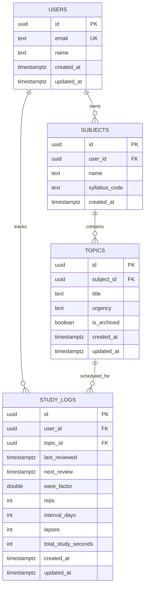

# CogniPlan: Final ER Diagram

This is the finalized ER design for the PostgreSQL. It incorporates all the necessary tables, relationships, constraints, and indexes to support the SRS logic and API contracts defined in the project blueprint. This diagram will serve as the foundation for the database schema implementation and API development in the coming weeks.

## 1) Scope and intent

This schema is designed to support:
- Topic queue response (`GET /api/v1/topics/queue`)
- Review submission request (`POST /api/v1/topics/review`)
- SM-2 scheduling logic

## 2) Final ER diagram



## 3) Relationship decisions

- `users -> subjects` is 1-to-many.
- `subjects -> topics` is 1-to-many.
- `users <-> topics` is many-to-many, materialized via `study_logs`.
- One row in `study_logs` represents one user-topic SRS state.

## 4) Required constraints

- Primary keys on all tables (`id`).
- Foreign keys on relationship columns.
- Unique key on `users.email`.
- Unique composite key on `study_logs(user_id, topic_id)`.
- Check constraint on `topics.urgency` in (`low`, `medium`, `high`).
- Default `study_logs.ease_factor = 2.5`.
- Default `study_logs.reps = 0`.
- Default `study_logs.interval_days = 1`.
- Non-negative checks for `reps`, `lapses`, and `total_study_seconds`.

## 5) Required indexes

- `study_logs(user_id, next_review)` for due queue lookup.
- `topics(subject_id)` for topic lookup by subject.
- Implicit indexes from unique constraints.

## 6) API mapping guarantee

The ER supports the agreed queue shape directly:
- `queue[].id` <- `topics.id`
- `queue[].subject` <- `subjects.name`
- `queue[].title` <- `topics.title`
- `queue[].urgency` <- `topics.urgency`
- `queue[].reps` <- `study_logs.reps`
- `queue[].next_review` <- `study_logs.next_review`

## 7) SQL-style query skeleton for queue

```sql
SELECT
  t.id,
  s.name AS subject,
  t.title,
  t.urgency,
  sl.reps,
  sl.next_review
FROM study_logs sl
JOIN topics t ON t.id = sl.topic_id
JOIN subjects s ON s.id = t.subject_id
WHERE sl.user_id = $1
  AND sl.next_review <= NOW()
  AND t.is_archived = FALSE
ORDER BY sl.next_review ASC;
```

## 8) Notes for Week 2 compatibility

This ER is already SM-2 ready because `study_logs` includes:
- `last_reviewed`
- `next_review`
- `ease_factor`
- `reps`

No schema redesign is required before starting the Week 2 algorithm.
